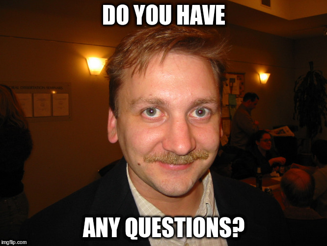

```{r setup, include=FALSE}
options(htmltools.dir.version = FALSE)
```

# Many reasons to set up a website or blog
- document projects
- contribute to community
- build a portfolio
- practice writing
- learn about web technology

--
## But it should be simple...
- ... to set up, 
- ... to use and
- ... to publish!

???
Why should you consider a blog?
- web is/ should be about collaboration, freedom and sharing (not surveillance)
- you want to contribute, you need some kind of plattform to do so.
- But it would be nice to be able to share R code with others! 
- I guess, most of us use RStudio for working with R and many of us wil use git and github to control and possibly share our source code. RStudio provides extensive support for literate programming and reproducable research via the `knitr` and `rmarkdown` packages.
- easily contribute to R-bloggers or other blog aggregators

---
# Choose the right tool for the job!

.pull-left[
## Hugo
- *very fast* static site generator written in Go
- seperates content and design
- secure compared to CMS
- good performance
]

--

.pull-right[
## RMarkdown
- powerful literate programming tool
- almost native solution for RStudio
- offers *many* possible output formats
]

--
### 🢣 `blogdown`-package by [Yihui Xie](https://github.com/yihui)!


---
class: inverse, center
background-image: url(https://proquestionasker.github.io/blog/img/SiteTutorial.jpg)
background-size: 600px

# Demotime!

.footnote[
*Image-Credit: [Amber Thomas](https://proquestionasker.github.io/blog/Making_Site/)*
]
---
# (Creating a Website locally)
### Install Hugo
```{r, eval=FALSE}
devtools::install_github("Rstudio/blogdown")
library(blogdown)
install_hugo()  # install Hugo
```

### Create Website
```{r, eval=FALSE}
new_site(theme = "frjo/hugo-theme-zen")  # create website
new_post("tokyo.R", rmd = TRUE)
```

### Build (and publish)
```{r, eval=FALSE}
build_site()
```

???
- Create site needs a empty folder
- explain `options(servr.daemon = TRUE)`

---
# Why I like `blogdown`
.pull-left[
### great
- very easy to set up and use
- Hugo is very fast!
- allows to write blogposts from the comfort of your favorite editor. ;-)
- great variability of easy to install themes
- all the features of (html-)rmarkdown can be used
]

.pull-right[
### almost great

- publication could be even more streamlined
- not possible to add content outside of the editor
]

---
# I hope, you will build your own site soon!

```{r, out.width = "600px", echo = FALSE, fig.align='center'}

```

???
- I shope you will also create a blogdown page soon (and tell me about it)
- if you come to Germany in the future, please get in touch!

---
# References
- Github-repo for this talk: <br>
    - https://github.com/henningsway/Tokyo.R
- `blogdown`-repo:
    - https://github.com/rstudio/blogdown
- Blogposts on using blogdown:
    - *Publishing to githubpages:* <br>
      https://proquestionasker.github.io/blog/Making_Site/
    - *2-repo-approach:* <br>
      https://tclavelle.github.io/
    - *Subtree-approach:* <br>
      https://hjdskes.github.io/blog/update-deploying-hugo-on-personal-gh-pages/
- Hugo
    - https://themes.gohugo.io/ (Themes)
    - https://gohugo.io/overview/introduction/ (Documentation)
- RMarkdown: 
    - https://rmarkdown.rstudio.com/